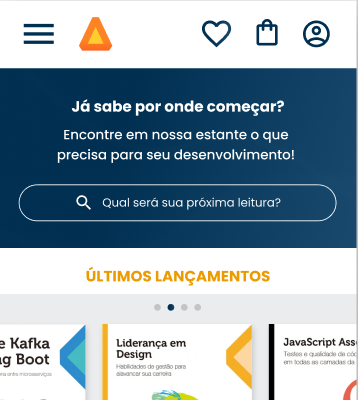

<h1 align="center">
    
</h1>

<h4 align="center"> 
	👾 Alura Books - Site ficticio de venda de livros educacionais 👾
</h4>

## 🤖 Onde encontrar ?

O Projeto está hospedado pelo GitHub Pages e você pode acessar pelo <a href="https://brunnasousa.github.io/alurabooks/" target="_blank" rel="external">link.</a> 

- link principal: https://bit.ly/alura-books

- link alternativo: https://brunnasousa.github.io/alurabooks/

## 💻 Sobre o projeto

- Projeto feito seguindo exemplo do mobile-first, responsividade trabalhada com: 428px, 1024px e 1728px.
- Site de divulgação do Alura Books: revendedora de livros educacionais de: Programação, Front-End, InfraEstrutura, Busisness e Design & UX.

## 🛠 Ferramentas

As seguintes ferramentas foram usadas na construção do projeto:

-   [HTML](https://developer.mozilla.org/pt-BR/docs/Web/HTML)
-   [CSS](https://developer.mozilla.org/pt-BR/docs/Web/CSS) - Mobile First

## 🎨 Paleta de cor

- #FFFFFF; -> branco
- #000000 -> preto
- #474646 -> cinza
- #858585 -> cinza-claro
- #F9F9F9-> cinza-branco
- #EB9B00 -> laranja
- #002F52 -> azul
- #EBECEE; -> cor de fundo
- linear-gradient(97.54deg, #002F52 35.49%, #326589 165.37%) -> azul-degrade
- "Poppins" -> fonte-principal
- Josefin Sans -> fonte-secundaria

## 📖 Layout

O layout da aplicação está disponível no Figma:

## 📝 Autor - Contact

<table>
  <tr>
    <td align="center">
      
 

      <a href="https://www.linkedin.com/in/brunna-sousa">
         
         
          <b>Feito com ❤️ por Brunna Sousa 😄</b> 
          <b>Entre em contato.  </b>
        
      </a>
    </td>
  </tr>
</table>

## 👀 Observações Importantes

* Certificado pela [Alura](https://cursos.alura.com.br/user/brunnad68/course/html-css-responsividade-mobile-first/certificate) - HTML e CSS: responsividade com mobile-first.